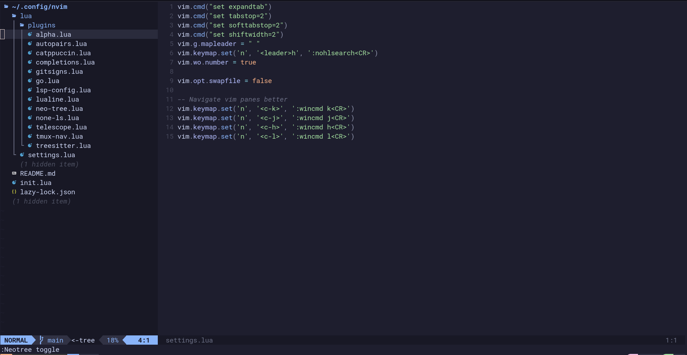

# NeoVim Configuration
This is my personal NeoVim configuration from scratch. 



## Setup
Currently the way settings work is the [Lazy](https://github.com/folke/lazy.nvim) package manager looks for a *lua/plugins* directory
and loops through all lua files and grabs the exported tables. Each table is setup in a standard way.

For example:

```lua
    return {
      "nvim-treesitter/nvim-treesitter",
      build = ":TSUpdate",
      config = function()
        local config = require("nvim-treesitter.configs")
        config.setup({
          ensure_installed = { "lua", "go"},
          highlight = { enable = true },
          inent = { enable = true },
        })
      end
    } 
```

### Install
To install this configuration follow the steps:

1. (optional) Make nvim backup: `mv ~/.config/nvim ~/.config/nvim.bak`
2. Clone this repo into config folder: `git clone https://github.com/rdcuzins/nvim.git ~/.config/nvim`
3. Run neovim: `nvim`

## Settings
The global settings can be found in *lua/settings.lua* and currently has common settings my brain needs:

```lua
vim.cmd("set expandtab")
vim.cmd("set tabstop=2")
vim.cmd("set softtabstop=2")
vim.cmd("set shiftwidth=2")
vim.g.mapleader = " "
vim.keymap.set('n', '<leader>h', ':nohlsearch<CR>')
vim.wo.number = true

vim.opt.swapfile = false
```

## Keybindings
The current custom keybindings set throughout the settings and global are:

```lua
-- Settings
vim.keymap.set('n', '<c-k>', ':wincmd k<CR>')
vim.keymap.set('n', '<c-j>', ':wincmd j<CR>')
vim.keymap.set('n', '<c-h>', ':wincmd h<CR>')

-- GitSigns
vim.keymap.set("n", "<leader>gp", ":Gitsigns preview_hunk<CR>", {})
vim.keymap.set("n", "<leader>gt", ":Gitsigns toggle_current_line_blame<CR>", {})

-- Telescope
vim.keymap.set('n', '<leader>ff', builtin.find_files, {})
vim.keymap.set('n', '<leader>fg', builtin.live_grep, {})

-- Lsp-Config
vim.keymap.set("n", "K", vim.lsp.buf.hover, opts)
vim.keymap.set("n", "gd", vim.lsp.buf.definition, opts)
vim.keymap.set({ "n", "v" }, "<leader>ca", vim.lsp.buf.code_action, opts)

-- Neotree
vim.keymap.set("n", "<leader>e", ":Neotree toggle<CR>", {})
vim.keymap.set("n", "<C-n>", ":Neotree action=show toggle<CR>", {})
vim.keymap.set("n", "<leader>bf", ":Neotree buffers reveal float<CR>", {})

-- None-Ls
vim.keymap.set("n", "<leader>lf", vim.lsp.buf.format, {})

-- Tmux-Nav
vim.keymap.set("n", "<C-h>", "<Cmd>NvimTmuxNavigateLeft<CR>", {})
vim.keymap.set("n", "<C-j>", "<Cmd>NvimTmuxNavigateDown<CR>", {})
vim.keymap.set("n", "<C-k>", "<Cmd>NvimTmuxNavigateUp<CR>", {})
vim.keymap.set("n", "<C-l>", "<Cmd>NvimTmuxNavigateRight<CR>", {})
```

## Plugins
The list of plugins will probably change and be tweaked often.

### Alpha 
This is a landing page when running **nvim** on a directory. This will show latest files touched.

[Source](https://github.com/goolord/alpha-nvim) 

### Autopairs
This is a simple plugin that autocompletes brackes and parenthesis.

[Source](https://github.com/windwp/nvim-autopairs)

### Catppuccin
This is my favorite theme suite. I use it for everything.

[Source](https://github.com/catppuccin/nvim)

### Completions
This is a grouping of tools to help with autocompletion windows inside nvim. These tools work together to make a decent
environment. The tools include:

- [cmp-nvim-lsp](https://github.com/hrsh7th/cmp-nvim-lsp)
- [L3MON4D3/LuaSnip](https://github.com/L3MON4D3/LuaSnip)
- [hrsh7th/nvim-cmp](https://github.com/hrsh7th/nvim-cmp)

### Gitsigns
This is a simple plugin to git symbols into neovim.

[Source](https://github.com/lewis6991/gitsigns.nvim)

### Go
This is a suite of utilities to make developing in Go more streamlined.

[Source](https://github.com/ray-x/go.nvim)

### Lsp-config
This is another collection of tools used together to provide language server support. These tools include:

- [williamboman/mason.nvim](https://github.com/williamboman/mason.nvim)
- [williamboman/mason-lspconfig.nvim](https://github.com/williamboman/mason-lspconfig.nvim)
- [neovim/nvim-lspconfig](https://github.com/neovim/nvim-lspconfig)

### Lualine
This adds a sexy status bar to the bottom of neovim. This displays customizable information including git branch.

[Source](https://github.com/nvim-lualine/lualine.nvim)

### NeoTree
This is adds a file explorer in an IDE like fassion that is toggleable. It is also highly configurable.

[Source](https://github.com/nvim-neo-tree/neo-tree.nvim)

### NoneLS
This is a fork of the infamous **null-ls** which provides the capabilities of an LSP client connection to diagnostic
and formatting tools in an LSP like way.

[Source](https://github.com/nvimtools/none-ls.nvim)

### Telescope
This provides the functionality of quickly jumping through project files when searching for fuzzy words.

[Source](https://github.com/nvim-telescope/telescope.nvim)

### Tmux-Nav
This just provides easier support to bounce between Tmux pains in a way that works for my brain.

[Source](https://github.com/alexghergh/nvim-tmux-navigation)

### Treesitter
This is where the syntax highlighting magic happens. Its easy to install other syntaxes using built in functions like:
**:TSInstall**

[Source](https://github.com/nvim-treesitter/nvim-treesitter)

